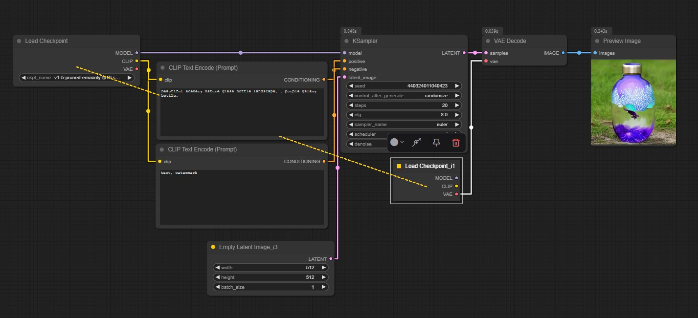
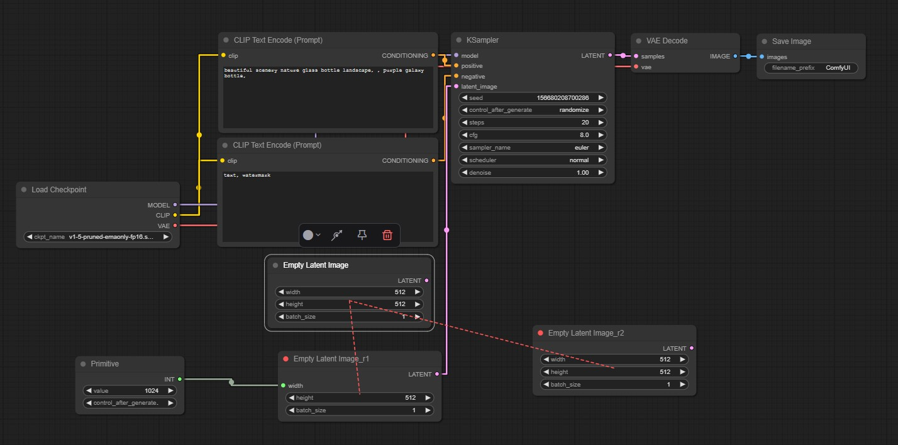
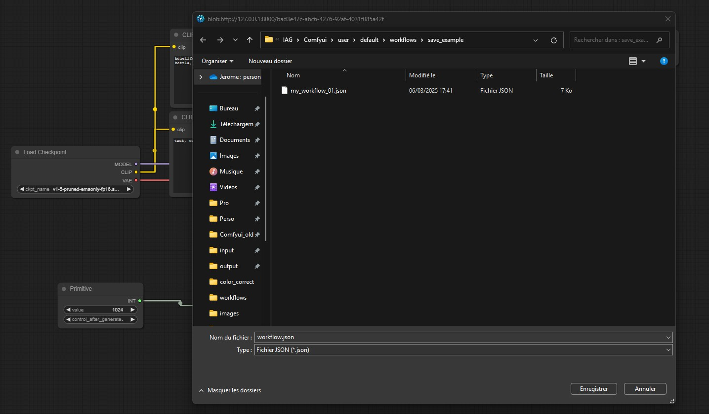

# ComfyUI Tricks

## Overview

This plugin suite enhances the workflow management capabilities of ComfyUI, providing advanced node manipulation and organization tools. The suite consists of three key plugins:

1. **InstanceNode**
2. **ReplicateNode**
3. **Save Workflow**

## Plugins Details

### 1. InstanceNode

#### Description
InstanceNode is a powerful extension that introduces node instancing functionality to ComfyUI. It allows users to create node instances that dynamically sync their widgets and inputs with the original source node.

This plugin is designed to improve workflow efficiency in **ComfyUI**, making complex node management more intuitive and effective.
The main objective is to simplify the visualization of complex graphs by limiting line crossing and long rerouting lines.

**IMPORTANT**: a node instance is not editable and it inherits all the properties of its source node. 
It's just a visual representation to facilitate connections, but **it doesn't need to be evaluated** !

#### Key Features
- **Node Instancing**: Addition of a “Instance Node” option in the context menu to create instance of a source node that remain linked.
- **Synchronized Widgets & Input**: Any changes in the source node's widgets propagate automatically to all its instances.
- **Auto-resizing Nodes**: The plugin dynamically adjusts node sizes based on their content for better visibility
- **Visual Representation**: Provides a yellow color circle and dashed-line links to distinguish instances from standard node connections.
- **Graph Persistence**:  Automatically rebuilds instance links upon graph load and manages node deletion intelligently to preserve structure.
- **Dynamic Node Management**: Handles node removal and reassignments seamlessly.

#### Usage
- Right-click on a node and select **Instance Node** to create a linked replicate.
- A replicate node can be recognized by the red circle at top left. 
- Adjust any widget in the original node, and the changes will reflect across all instances.
- Deleting an original node will reassign the first instance node as the new source. 
  This instance then recovers all its properties and becomes editable again.
- Select a instance node to show the relashionship with the nodes sources by a yellow dashline.
- Select a source node to show the relashionship with all replicate nodes by red dashlines.

### 2. ReplicateNode

#### Description
ReplicateNode provides advanced node replication capabilities, allowing users to create synchronized node replicates with independent input connections.  

**IMPORTANT**: a replicate node doesn't necessarily use the same inputs as the source node and needs to be evaluated in the graph (unlike an instance node). Each replicate is therefore independent and must be evaluated.

#### Key Features
- **Node Replication**: Addition of a “Replicate Node” option in the context menu to duplicate a node with automatic synchronization of properties.
- **Automatic Widget Syncing**:  Ensures that changes made to a node are propagated to all replicates (including the source node).
- **Visual Representation**: Provides a red color circle and dashed-line links to distinguish replicates from standard node connections..
- **Graph Persistence**: Rebuilds replication links upon loading a workflow.
- **Dynamic Node Management**: Handles node removal and reassignments seamlessly.

#### Usage
- Right-click on a node and select **Replicate Node** to create a linked replicate.
- A replicate node can be recognized by the red circle at top left. 
- Adjust any widget in the original node, and the changes will reflect across all replicates.
- Adjust any widget on one of the replicates and the changes will be reflected on all linked nodes (including the source).
- Deleting an original node will reassign the first replicate node as the new source.
- Select a replicate node to show the relashionship with the nodes sources by a red dashline.
- Select a source node to show the relashionship with all replicate nodes by red dashlines

### 3. Save Workflow

#### Description
A standard UI plugin to save ComfyUI workflows quickly and easily.

#### Usage
- Right-click on the canvas
- Select **Save Workflow**
- Choose the save location for your workflow JSON file

## Installation

1. Open a terminal into the ComfyUI `custom_nodes` directory
2. Clone the repository : 
git clone https://github.com/jerome7562/Comfyui-tricks.git
3. Restart ComfyUI to apply the changes

or 
1. download the repository
2. Copy the plugin folder into the ComfyUI `custom_nodes` directory
3. Restart ComfyUI to apply the changes

## Licensing

All plugins are distributed under the **GNU General Public License version 3**.

## Compatibility

- **ComfyUI Version**: Compatible with ComfyUI versions as of February 16, 2025
- **Developed by**: Jerome Bacquet, CIRCUS

## Contribution

Contributions and feedback are welcome. Please submit issues or pull requests to the respective plugin repositories.

## Disclaimer

- InstanceNode instances are non-editable and inherit source node properties
- ReplicateNodes are editable with independent input connections
